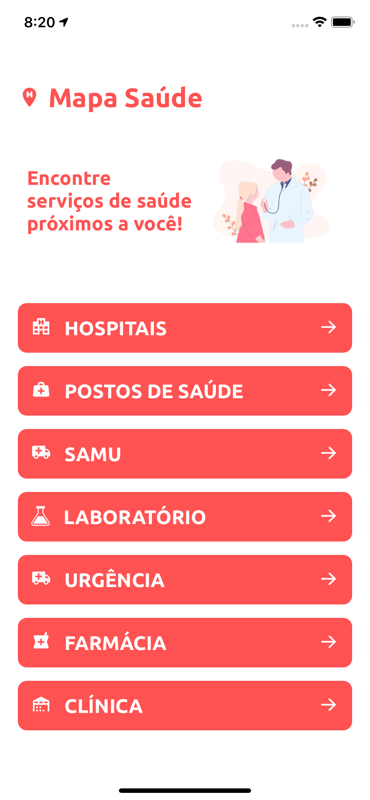
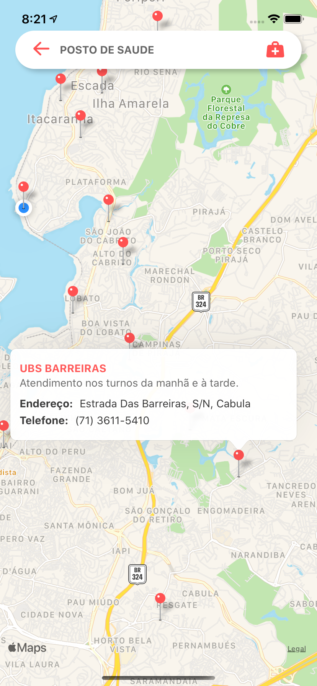
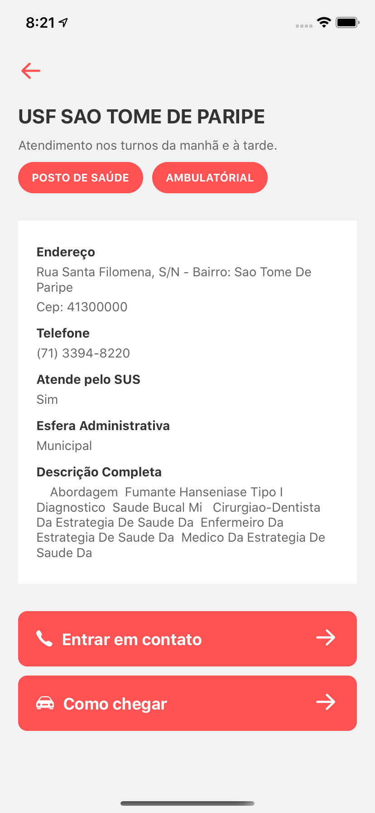
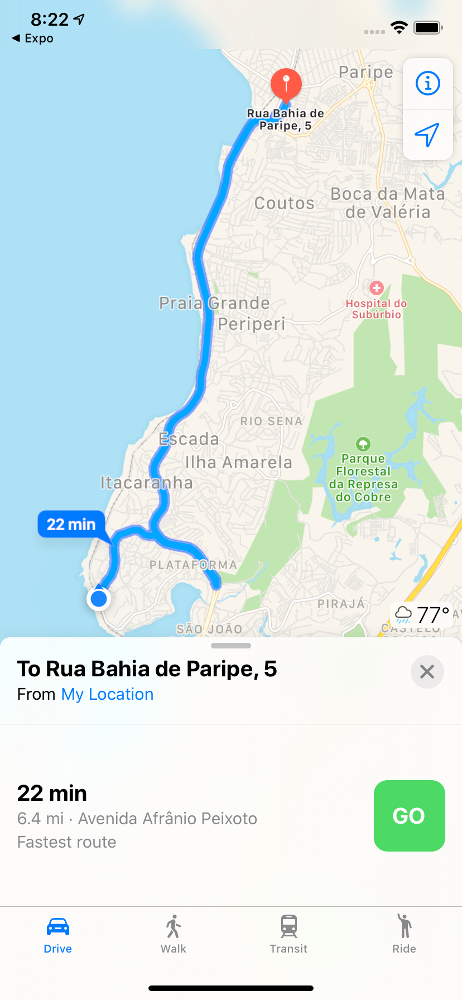
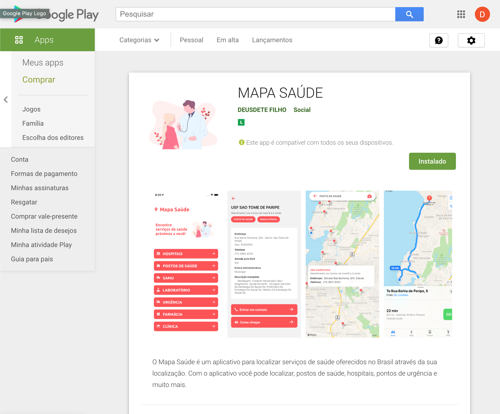

<h1 align="center">
    Mapa Saúde
</h1>

## :bookmark: Sobre

Desenvolvimento de uma aplicação de consulta de serviços de saúde.

Como consequência da pandemia do Covid-19, aumentou a procura de serviços de saúde em todo o mundo.

No App é possível localizar locais de saúde através da sua localização, usando a API pública do serviços de saúde do Brasil.

## :rocket: Tecnologias Utilizadas

O projeto foi desenvolvido utilizando as seguintes tecnologias

- [React Native](https://reactnative.dev/)
  - [React Native Maps](https://github.com/react-native-community/react-native-maps)
  - [React Native Communications](react-native-communications)
- [React Navigation v5](https://reactnavigation.org/)
- [Styled Components](https://styled-components.com/)
- [Axios](https://github.com/axios/axios)
- [Expo](https://expo.io/)
  - [Expo Location](https://docs.expo.io/versions/latest/sdk/location/)

## :iphone: Telas

<h4 align="center">
    
    
    
    
</h4>
## App publicado no Google Play

---

<h4 align="center">
    Feito com 💜 by Deusdete Filho</a>
</h4>
